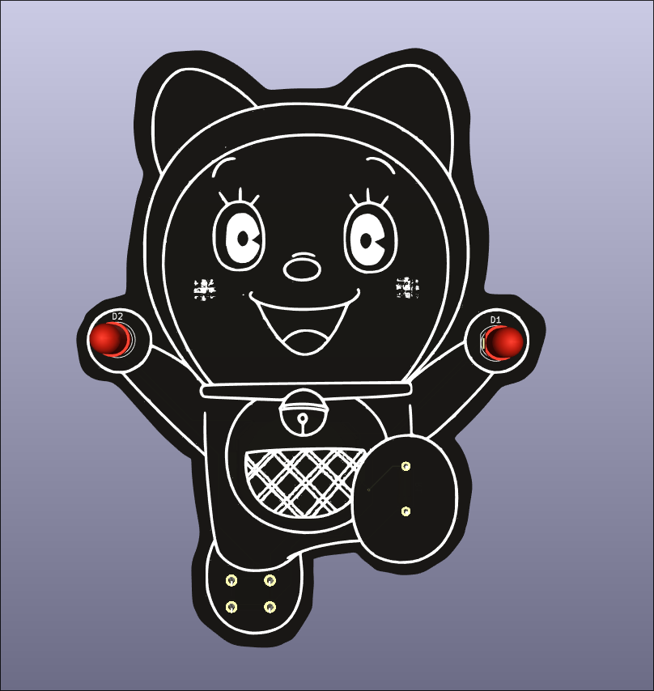
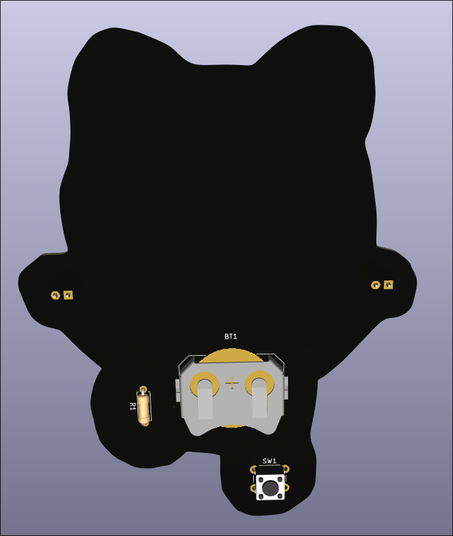
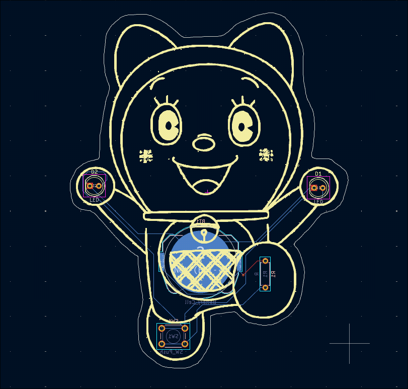
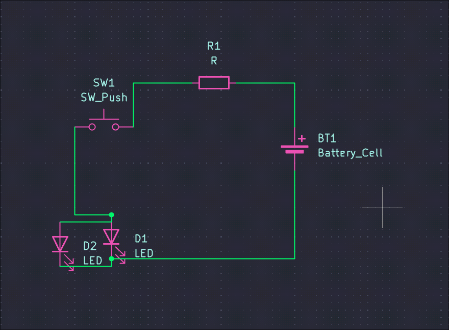

# Dorami circuit
This is my first ever circuit, but it wasn't too difficult.

I felt it to be a little difficult while creating the PCB from the schematic.

This is a circuit that lights up 2 LEDs. I have used a battery, 2 lights, a pushbutton, and a resistor.

## Screenshots

## BOM

| Part Name  | Quantity |
| ------------- | ------------- |
| Coin-sized Battery Holder  | x1  |
| LEDs  | x2  |
| 220 ohm resistor | x1 |
| 6mm tactile push buttons | x1 |
